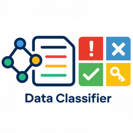

<!-- $ convert logo_large.png -resize 270x270 project_logo.jpg -->

# Data Classifier; An AI-driven approach to Label LLM Training Data
[]()
[]()
[]()
[](./LICENSE.md)

This repository contains a rule-based data classifier to label LLM training/fine-tuning datasets into various categories such as unsafe, spammy, sensitive, etc.

### Highlights

- Rule-based heuristics implemented in `data_classifier/classifier.py`
- Command-line wrapper at `scripts/classify.py` for file and single-text classification
- Small unit test suite in `tests/test_classifier.py`

### Quick start

1. Create and activate a virtual environment:

```bash
python -m venv .venv
source .venv/bin/activate
```

2. Install the minimal requirements (project currently lists only pytest). Many
	 classifier features require additional heavy dependencies (see Implementation notes).

```bash
pip install -r requirements.txt
```

If you plan to use the built-in model-backed checks (transformers / torch / spacy / fasttext),
install the extras (may require a GPU for acceptable speed):

```bash
python -m spacy download en_core_web_sm
```

Note: Some pre-trained models may be large and require a Hugging Face token for access.

## Usage

CLI (classify a file or single string):

```bash
# classify a JSONL file (each line is a JSON object containing a `text` field):
python scripts/classify.py --input examples/sample.jsonl --output out.jsonl --format jsonl

# classify a single text from the CLI
python scripts/classify.py --text "This is a sample sentence to classify."
```

The CLI writes a JSONL file where each object receives a `label` field (list of tags).

Python API (import and call):

```python
from data_classifier.classifier import classify

text = "Visit http://spam.example.com for a great deal"
tags = classify(text)
print(tags)  # -> e.g. ['Spammy']
```

Public functions you’ll likely use:

- `classify(text: str) -> list[str]` — returns zero or more tags describing the text.
- `classify_file(input_path, output_path, input_format='jsonl', text_field='text')` —
	helper used by the CLI (your script can call the classify function directly).

## License

This project is licensed under CC BY 4.0. See `LICENSE.md` for details.
